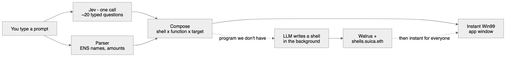
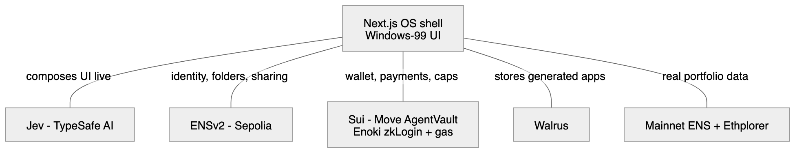

# Suica OS — ETHGlobal Tokyo 2026

A fully hallucinated, Windows‑98‑styled operating system where **every app is an agent** with an ENS name and a Sui wallet, and every UI is composed **in real time by Jev** (TypeSafe AI) — no LLM on the critical path.

Type anything into Start → *"excel of vitalik.eth portfolio"*, *"paint but roast vitalik.eth"*, *"doom but I'm shooting my losses"*, *"split bills with 4 friends"*, *"tetris but my portfolio"* — and a working, on‑chain agent app appears as you type.

- 🏆 Tracks: **Sui DeFi & Payments** · **ENS (Best Use of ENSv2, Sepolia)** · **Curvegrid (Best Digital Asset Dashboard)**
- 📄 Product spec: [`docs/PRD.md`](docs/PRD.md) · Code map: [`web/README.md`](web/README.md) · Submission: [`ethglobal-submission.md`](ethglobal-submission.md)
- 💻 App: [`web/`](web/) (Next.js 16 · React 19 · TypeScript)

## The idea

We're heading toward a future where agents do the work and we don't build apps anymore. But we still need interfaces — to *see* what our agents did, understand it, and approve or refuse it. So interfaces will be **generated on demand**, changing in real time and personal to whoever is using them. Suica OS is an experiment in that: an OS where every window is composed live, every app has an identity, and every dollar it moves is capped on‑chain.

**Apps are places, not programs.** Every app is an agent: an **ENSv2 name** (identity + a ~1 KB manifest in its text records) and a **Sui wallet** (an `AgentVault` with spend caps). The UI is disposable — anyone who resolves the name rebuilds the exact UI instantly, no model call.

## How a prompt becomes an app



On every keystroke, one call to **Jev** answers ~20 typed questions (which shell, which capability, what vibe, how risky) in ~70–500 ms. **Jev decides, code computes** — a deterministic parser extracts every number (ENS names, tokens, amounts), so a model never invents an amount. The app is composed from *shell × function × target*. Ask for a program we don't have and an LLM writes the shell in the background, sandboxed, then publishes it to Walrus at `shells.suica.eth`.

## How the tech fits together



| Layer | What | Track |
|---|---|---|
| **Jev** (TypeSafe AI, via Vercel AI Gateway) | Real‑time UI composition; never writes text, only answers typed questions | — |
| **ENSv2 on Sepolia** | `suica.eth` as a filesystem: subname registries = folders, EAC roles = sharing, text‑record manifests, per‑name PermissionedResolvers, non‑transferable usernames, aliasing = symlinks | ENS |
| **Sui + Move** | `AgentVault<T>` + `AgentCap` (per‑tx/day caps → on‑chain abort → BSOD), Enoki zkLogin + sponsored gas, PTB payroll/settle‑up, a mock AMM pool for real DCA/rebalance swaps | Sui |
| **Task Manager + My Computer** | Agents as processes; the AgentVault as a drive with a live day‑cap bar — a multi‑agent digital‑asset dashboard | Curvegrid |
| **Walrus** | Storage for LLM‑generated shells (blob + sha256) | Sui |
| **Mainnet ENS + Ethplorer** | Real read‑only portfolio data for any wallet (holdings, 24h/7d/30d, PnL) | — |

## Proven on‑chain (testnet)

- **Sui:** `AgentVault` Move package published to testnet; **zkLogin login + Enoki‑sponsored gasless transactions verified end‑to‑end** (sponsor pays gas). Over‑cap `agent_pay` **aborts on‑chain** (abort code 2 = EOverTxCap) → BSOD. Real gasless **Payroll** (atomic PTB batch), **Rebalancer** and **DCA** (SUI→SUSD swaps via our own deployed pool).
- **ENSv2 (Sepolia):** `suica.eth` + our own UserRegistry/PermissionedResolver deployed; folders, EAC sharing (verified 9/9 with two device keys), per‑name resolvers, usernames, and app‑move aliasing all verified live.

## Quick start

```bash
cd web
pnpm install
cp .env.example .env.local   # optional: add AI_GATEWAY_API_KEY to use Jev online
pnpm dev                      # http://localhost:3000
```

Without a key the OS runs on an offline keyword classifier with the exact same output shape as Jev (HUD shows `jev-offline`); ENS falls back to a demo index. Log on with Google for real Sui; continue as guest for paper mode.

## Sponsor code map

The single line-of-code links in the [submission](ethglobal-submission.md) point at the one representative line per track; the fuller file list per sponsor is here.

### Sui code
- `AgentVault<T>` Move package — caps, `agent_pay` (on-chain abort → BSOD): [`web/move/suica_vault/sources/vault.move`](web/move/suica_vault/sources/vault.move)
- Mock AMM pool for real swaps/DCA/rebalance: [`web/move/suica_pool/`](web/move/suica_pool)
- zkLogin + sponsored-tx routes: [`web/src/app/api/sui/zklogin/`](web/src/app/api/sui/zklogin) · [`sponsor/route.ts`](web/src/app/api/sui/sponsor/route.ts) · [`execute/route.ts`](web/src/app/api/sui/execute/route.ts)
- Payroll PTB (atomic batch, over-budget reverts): [`web/src/app/api/sui/vault/payroll/route.ts`](web/src/app/api/sui/vault/payroll/route.ts)
- Intent → tx builder (pay / vault_pay / swap): [`web/src/lib/sui/tx.ts`](web/src/lib/sui/tx.ts)
- Fixed signing dialog (Move abort → BSOD): [`web/src/system/Dialogs.tsx`](web/src/system/Dialogs.tsx)
- Deployment ids (testnet): [`web/src/lib/sui/deployment.json`](web/src/lib/sui/deployment.json)

### ENSv2 code
- Registry / resolver / EAC contracts + roles: [`web/src/lib/ens/contracts.ts`](web/src/lib/ens/contracts.ts)
- On-chain minting, manifests, per-name resolvers, aliasing: [`web/src/lib/ens/onchain.ts`](web/src/lib/ens/onchain.ts)
- Per-browser device key + EIP-191 signed requests: [`web/src/lib/ens/device.ts`](web/src/lib/ens/device.ts) · [`auth.ts`](web/src/lib/ens/auth.ts)
- Mint / roles (EAC) / username routes: [`mint`](web/src/app/api/ens/mint/route.ts) · [`roles`](web/src/app/api/ens/roles/route.ts) · [`username`](web/src/app/api/ens/username/route.ts)
- Deployed contract addresses: [`web/src/lib/ens/deployment.json`](web/src/lib/ens/deployment.json)

### Curvegrid code
- Dashboard UI (Task Manager + My Computer): [`web/src/system/SystemApps.tsx`](web/src/system/SystemApps.tsx)
- Live on-chain AgentVault + AgentCap state feed: [`web/src/app/api/sui/vault/state/route.ts`](web/src/app/api/sui/vault/state/route.ts)

## Repo layout

| Path | What |
|---|---|
| `web/src/os/`, `web/src/styles/win99.css` | The Windows‑98 OS shell, window manager, Start menu, Welcome (landing page) |
| `web/src/lib/intent/`, `web/src/lib/compose/` | Jev question schema + parser; data shapes, functions, composer |
| `web/src/shells/` | Excel, Minesweeper, Paint, Weather, Notepad, Explorer, Doom, Hologram, generated shells |
| `web/src/lib/ens/`, `web/src/app/api/ens/` | ENSv2 minting, EAC roles, per‑name resolvers, usernames, aliasing |
| `web/src/lib/sui/`, `web/src/app/api/sui/`, `web/move/` | zkLogin, sponsored tx, `AgentVault`/pool Move packages, payroll/swap |
| `web/src/system/` | Fixed OS surfaces: signing dialog, Task Manager, My Computer, BSOD |
| `web/src/assistant/`, `web/src/lib/genshell/` | Tappy (the OS agent); LLM‑generated shell pipeline |

## Team

Solo project by **Fabian Ferno** — full stack (OS shell, Jev composer, ENSv2, Sui/Move, dashboard).

- Twitter/X: [@fabianferno](https://x.com/fabianferno)
- Telegram: [@fabianferno](https://t.me/fabianferno)
- GitHub: [github.com/fabianferno](https://github.com/fabianferno)

Built at ETHGlobal Tokyo 2026. "Windows 98" is a parody UI kit; the assistant is an original character.
